```mermaid
C4Context
  title Dweb Browser 架构图

  Container_Ext(dwebview, "DWebView", "一个面向多平台的webview标准")
  Container_Ext(reverseProxy, "reverse_proxy", "提供tls加密与反向代理")
  Container_Ext(httpGateway, "http gateway", "http协议网关")
  Container_Ext(plaoc, "plaoc plugins/server", "前后端开发套件")

  Rel(reverseProxy, dwebview, "提供代理地址")
  UpdateRelStyle(reverseProxy, dwebview, $textColor="green")

  Rel(reverseProxy, httpGateway, "代理转发")
  UpdateRelStyle(reverseProxy, httpGateway, $textColor="yellow")

  Rel(plaoc, reverseProxy, "请求代理")
  UpdateRelStyle(plaoc, reverseProxy, $textColor="yellow",$offsetX="140")

  Container_Boundary(browser, "browser.dweb") {
    Container(webBrowser, "web.browser.dweb", "网页浏览器应用")
    Container(desk, "desk.browser.dweb", "桌面与多窗口")
    Container(jsProcess, "js-process.browser.dweb", "js运行容器")
    Container(jmm, "jmm.browser.dweb", "js应用模块管理")
    Container(download, "download.browser.dweb", "下载管理器")
    Container(mwebview, "mwebview.browser.dweb", "WebView渲染器")
    Container(zip, "zip.browser.dweb", "压缩解压工具")

    Rel(dwebview, jsProcess, "提供程序执行容器")
    UpdateRelStyle(dwebview, jsProcess, $textColor="green")
    Rel(mwebview, jsProcess, "提供应用渲染功能")
    UpdateRelStyle(mwebview, jsProcess, $textColor="green")
    Rel(jsProcess, jmm, "提供程序运行时")
    UpdateRelStyle(jsProcess, jmm, $textColor="red")

    Rel(dwebview, mwebview, "提供渲染视图")
    UpdateRelStyle(dwebview, mwebview, $textColor="green")

    Rel(zip, jmm, "提供解压功能")
    UpdateRelStyle(zip, jmm, $textColor="green")

    Rel(desk, webBrowser, "托管")
    UpdateRelStyle(desk, webBrowser, $textColor="yellow")
    Rel(desk, jmm, "托管")
    UpdateRelStyle(desk, jmm, $textColor="yellow")
    Rel(desk, download, "托管")
    UpdateRelStyle(desk, download, $textColor="yellow")
    Rel(desk, window, "窗口标准在具体平台的实现")
    UpdateRelStyle(desk, window, $textColor="cyan", "cyan")
  }
  Container_Boundary(std, "std.dweb") {
    Container(dns, "dns.std.dweb", "路由")
    Container(file, "file.std.dweb", "文件系统")
    Container(http, "http.std.dweb", "HTTP网络标准")
    Container(permission, "permission.std.dweb", "权限标准管理")
    Container(window, "window.std.dweb", "应用窗口标准")

    Rel(httpGateway, http, "提供标准网络监听服务")
    UpdateRelStyle(httpGateway, http, $textColor="green", "green")
  }
  Container_Boundary(sys, "sys.dweb") {
    Container(boot, "boot.sys.dweb", "启动项管理")
    Container(biometrics, "biometrics.sys.dweb", "基于生物信息的认证与加密")
    Container(clipboard, "clipboard.sys.dweb", "剪切板")
    Container(config, "config.sys.dweb", "系统通用设置")
    Container(device, "device.sys.dweb", "设备信息")
    Container(haptics, "haptics.sys.dweb", "触觉反馈与震动")
    Container(location, "location.sys.dweb", "定位服务")
    Container(mediaFile, "media.file.sys.dweb", "多媒体文件")
    Container(motionSensors, "motion-sensors.sys.dweb", "运动传感器")
    Container(notification, "notification.sys.dweb", "通知")
    Container(notification, "notification.sys.dweb", "系统通知")
    Container(permissionSys, "permission.sys.dweb", "系统权限")
    Container(share, "share.sys.dweb", "分享")
    Container(toast, "toast.sys.dweb", "消息气泡")
    Container(barcodeScanning, "barcode-scanning.sys.dweb", "图形条码解析")
  }

  UpdateLayoutConfig($c4ShapeInRow="4", $c4BoundaryInRow="1")
```

## 项目文件夹结构

现在项目结构是有这么一些级别（由底层到高层）：

1. `platform*`（包括 platformIos、platformNode、platformBrowser）这是最底层的一些东西，这项目通常独立存在，通常是作为其它项目的辅助存在
1. `helper*` （包括 helper、helperPlatform、helperCompose）这是一些工具集项目
1. `pure*` （包括 pureIO、pureHttp、pureImage、pureCrypto）这是一系列标准库项目，提供跨平台的标准库
1. `dweb-browser-module` （包括 DWebView、browser、core、gradlew、shared、sys、window） 项目主要业务模块
1. `dweb-browser-app` （包括 `app/*` 下的文件夹）各个平台的入口程序，提供标准 App 配置和启动流程
