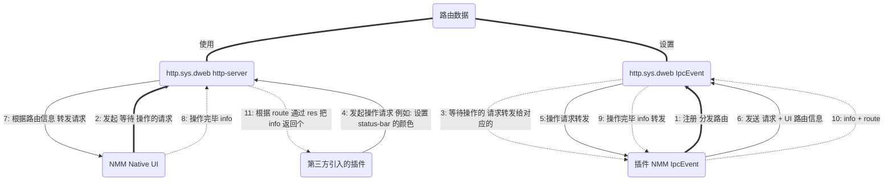

# 参考实例：
- https://github.com/ionic-team/capacitor-plugins/blob/main/share/src/web.ts

# 在dweb_browser工程中的实现
## 概述
- 通过 htt.sys.dweb 模块为中心实现

## 流程图说明

```mermaid
graph TB

http(http.sys.dweb http-server);
httpIpcEvent(http.sys.dweb IpcEvent)
plugin(第三方引入的插件)
routes(路由数据)
NMM(插件 NMM IpcEvent)
UI(NMM Native UI)

routes ===|使用| http
routes ===|设置| httpIpcEvent

NMM ===>|1: 注册 分发路由| httpIpcEvent
UI ==> |2: 发起 等待 操作的请求| http
httpIpcEvent -.->|3: 等待操作的 请求转发给对应的|NMM

plugin --->|4: 发起操作请求 例如: 设置 status-bar 的颜色| http
httpIpcEvent --->|5:操作请求转发|NMM
NMM --->|6: 发送 请求 + UI 路由信息|httpIpcEvent
http --->|7: 根据路由信息 转发请求| UI
UI -.->|8: 操作完毕 info|http
httpIpcEvent -.->|9: 操作完毕 info 转发| NMM
NMM -.->|10: info + route |httpIpcEvent
http -.->|11: 根据 route 通过 res 把 info 返回个|plugin


 
```

