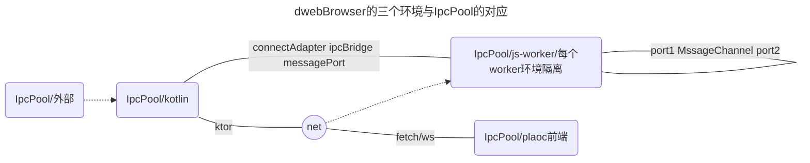
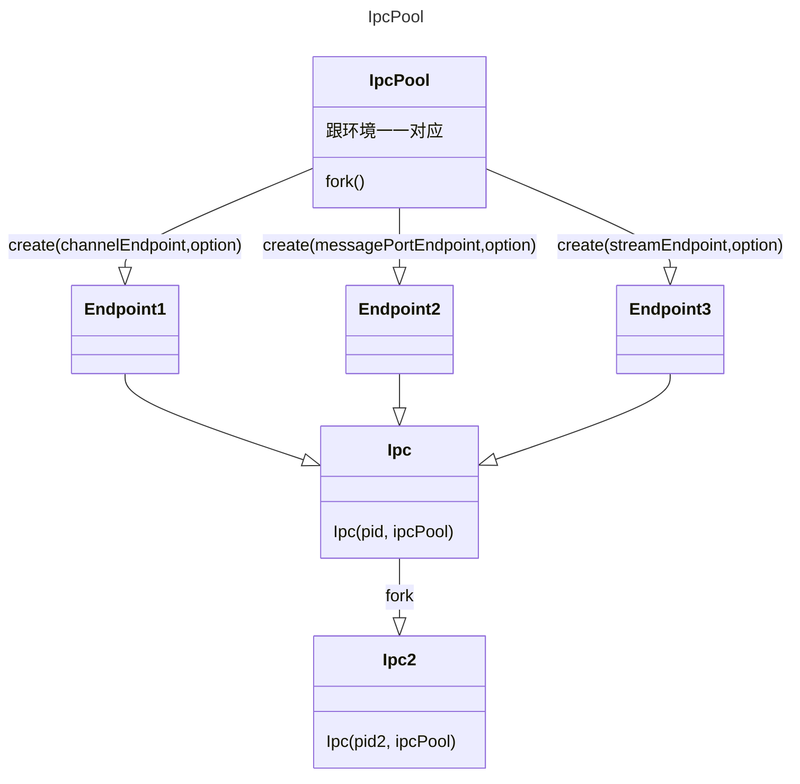
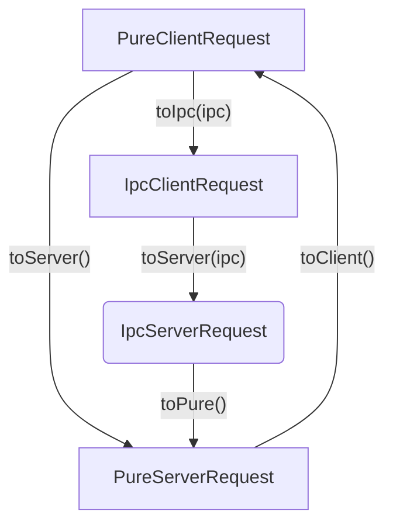

## 关于当前环境

## 关于Ipc

### 目标
1. IpcBody对应各个上下文的IpcPool更加清晰，并且可以针对上下文转发或者其他操作。
2. 提供了标准，互相连接更方便
3. 各司其职，连接在pool完成，ipc负责通信。
4. 减少有些地方抽象一层ReadableStream的编解码

## 关于 IpcRequest 与 PureRequest 的关系

1. Pure系列是最顶层的抽象，一般来说直接面向它开始编程总是没错的。
2. 正如 nativeFetch 需要参数，请求是从 PureClientRequest 开始构建。底层会按需自动转化成
   ipcClientRequest
3. ipcClientRequest 被 clientIpc.postMessage 传输，被 serverIpc.onMessage 收到，此时该
   ipcClientRequest 会被转化成 ipcServerRequest，用于 onRequest{} 响应函数内。
4. 出于安全性，ipcServerRequest 不允许直接逆转为 ipcClientRequest。通常有这种需求的，是需要对请求进行转发，那么此时需要借用
   pure 系列来进行间接转化，比如：nativeFetch(ipcServerRequest.toPure().toClient())
5. PureServerRequest 作为最顶层的抽象，并不总是来自于 ipcServerRequest。比如：有可能来自 Ktor 的
   ApplicationRequest