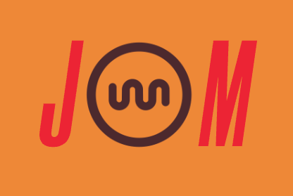

<br />
<br />

<p align="center">

</p>

<br />
<br />


# About dweb-jmm-bundler


[![Telegram Group][telegram-badge]][telegram-url]

[telegram-badge]: https://cdn.jsdelivr.net/gh/Patrolavia/telegram-badge@8fe3382b3fd3a1c533ba270e608035a27e430c2e/chat.svg
[telegram-url]: https://t.me/+SiZ53KtzsMw0M2Rl

DwebBrowser 前后端打包工具，把您开发的包打包成`.jmm`形式。

### @bfex/bundle

```
 全局安装指令
 # npm方式
   npm i @bfex/dweb-jmm-bundler -g

 # yarn方式
   yarn global add @bfex/dweb-jmm-bundler
```

#### 使用

安装完直接运行jmm，开启交互式打包

```bash
jmm
```

## future

1. 链上 APPID 认证申请。
2. 上传到 DwebBrowser DAPP 商城。
